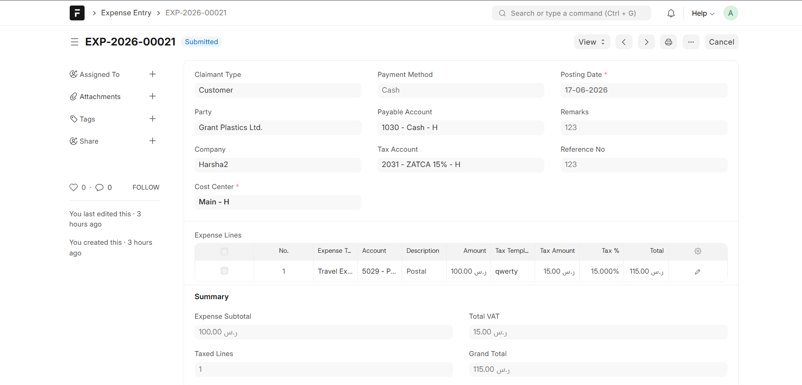
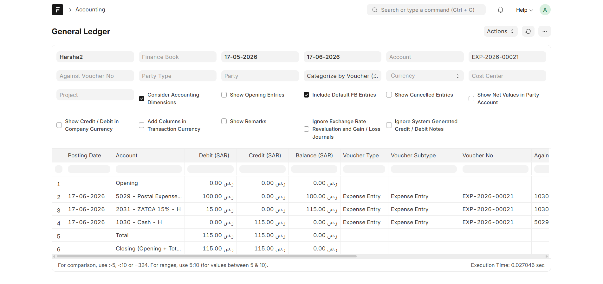

# expense_claudion

**Expense Entry & Management module for ERPNext** by **ERPGulf**

`expense_claudion` provides a custom **Expense Entry** DocType for recording operational expenses and posting accurate **General Ledger (GL)** entries in ERPNext without relying on Purchase Invoices or standard Expense Claims.

This module is designed for **direct expense accounting**, internal reimbursements, petty cash usage, and controlled payable posting.

---

## Features

• Custom **Expense Entry** DocType  
• Multi-line expense recording  
• Automatic GL posting on submit  
• Tax handling via separate tax account  
• Payable / settlement account support  
• Claimant-based expense tracking  
• Cost center allocation  
• Built-in **GL Preview (Accounting Ledger Preview)**  
• ERPNext-native accounting behavior  

---

## Expense Entry Overview

The screenshot below shows the **Expense Entry** form with expense lines, tax calculation, and totals.



## Accounting Behavior

On **Submit**, the system automatically generates General Ledger entries.

### GL Logic

The screenshot below shows the **General Ledger** generated after submitting the Expense Entry.



• Expense accounts → **Debited**  
• Tax account (if applicable) → **Debited**  
• Payable / Cash / Bank account → **Credited**  

### Party Handling

• **Party Type & Party are set only for Payable / Receivable accounts in GL**  
• Expense and tax accounts do **not** carry party information  
• This follows standard ERPNext accounting rules and avoids incorrect outstanding balances  

---

## GL Preview

Expense Entry supports **Accounting Ledger Preview**:

• View debit / credit impact before posting  
• Verify accounts, cost center, and totals  
• Helps prevent posting errors  

Preview is available after saving the document.

---

## Validations

The module enforces the following rules:

• Group accounts cannot be used in transactions  
• Cost Center is mandatory  
• Debit and Credit must balance  
• Tax Account required when tax amounts exist  

---

## Use Cases

Ideal for:

• Office expenses  
• Utility payments  
• Petty cash expenses  
• Employee reimbursements  
• Vendor expenses without Purchase Invoices  
• Internal cost allocations  

---

## Installation

Install the app using **bench**:

```bash
cd $PATH_TO_YOUR_BENCH
bench get-app $URL_OF_THIS_REPO --branch develop
bench install-app expense_claudion
bench migrate
bench restart 
```
---

## Configuration Notes

Before using the module, ensure:

• Company is properly configured  
• Valid Cost Centers exist  
• Expense accounts are non-group (leaf) accounts  
• Payable / Cash / Bank accounts are configured  
• Tax accounts (if used) are leaf accounts  

---

## Contributing

This app uses **pre-commit** for code formatting and linting.

Enable pre-commit hooks:

```bash
cd apps/expense_claudion
pre-commit install
```

Configured tools:

• ruff  
• eslint  
• prettier  
• pyupgrade  

---

## License

MIT License

---

## Contact & Support

Feel free to contact us for bug reports, feature requests, or implementation support.

**Email:** [support@erpgulf.com](mailto:support@erpgulf.com)

**Author:** Harsha  
**Organization:** ERPGulf